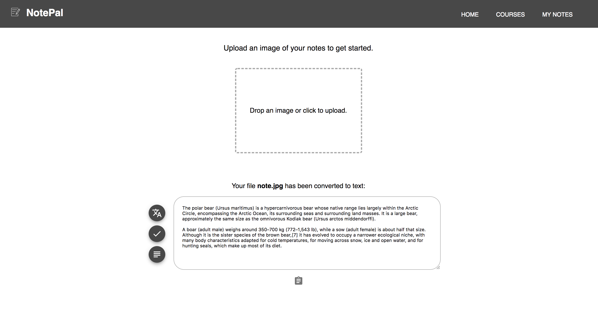

# NotePal

A web application for converting handwritten notes to editable text. 

## Features

Drag and drop or upload a photo of your notes and NotePal will automatically return the text content of the image in an editable format. 

### Translation
Easily translate your notes from English to French.

### Spell Checking
Checks your spelling so you don't have to. 

### Summarization 
Notes are too long? Use the summarization feature to quickly create a summary section for your study notes.

## Built With

* [Google Vision API](https://cloud.google.com/vision/)
* [Google Translate API](https://cloud.google.com/translate/)
* [Bing Spell Check API](https://azure.microsoft.com/en-ca/services/cognitive-services/spell-check/)
* [MeaningCloud Summarization API](https://www.meaningcloud.com/products/automatic-summarization)
* [Firebase](https://firebase.google.com/)
* [Heroku](https://www.heroku.com/)

This project was bootstrapped with [Create React App](https://github.com/facebookincubator/create-react-app).

## Contributors

* Kevin Jin
* Molan Ren
* Arjun Bhushan
* Priyanshu Gandhi
